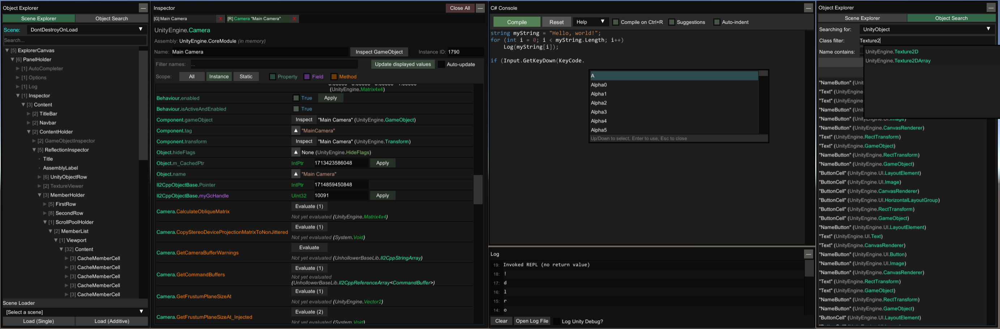

  

  🔍 An in-game UI for exploring, debugging and modifying Unity games.

  ✔️ Supports most Unity versions from 5.2 to 2020+ (IL2CPP and Mono).

  ☕ Enjoy this tool? Consider supporting me on <a href="https://ko-fi.com/sinaidev">ko-fi</a>!

# Releases  

  

## BepInEx

| Release | IL2CPP | Mono |
| ------- | ------ | ---- |
| BIE 6.X | ✅ [link](https://github.com/sinai-dev/UnityExplorer/releases/latest/download/UnityExplorer.BepInEx.Il2Cpp.zip) | ✅ [link](https://github.com/sinai-dev/UnityExplorer/releases/latest/download/UnityExplorer.BepInEx6.Mono.zip) |
| BIE 5.X | ✖️ n/a | ✅ [link](https://github.com/sinai-dev/UnityExplorer/releases/latest/download/UnityExplorer.BepInEx5.Mono.zip) |

1. Take the `UnityExplorer.BIE.[version].dll` file and put it in `BepInEx\plugins\`
2. In IL2CPP, you will need to download the [Unity libs](https://github.com/LavaGang/Unity-Runtime-Libraries) for the game's Unity version, create a folder `BepInEx\unity-libs\`, then extract the Unity libs into this folder.

<i>Note: BepInEx 6 is obtainable via [BepisBuilds](https://builds.bepis.io/projects/bepinex_be)</i>

## MelonLoader

| Release | IL2CPP | Mono |
| ------- | ------ | ---- |
| ML 0.4.0 | ✅ [link](https://github.com/sinai-dev/UnityExplorer/releases/latest/download/UnityExplorer.MelonLoader.Il2Cpp.zip) | ✅ [link](https://github.com/sinai-dev/UnityExplorer/releases/latest/download/UnityExplorer.MelonLoader.Mono.zip) | 
| ML 0.3.0 | ✅ [link](https://github.com/sinai-dev/UnityExplorer/releases/latest/download/UnityExplorer.MelonLoader_Legacy.Il2Cpp.zip) | ✅ [link](https://github.com/sinai-dev/UnityExplorer/releases/latest/download/UnityExplorer.MelonLoader_Legacy.Mono.zip) | 

1. Take the `UnityExplorer.ML.[version].dll` file and put it in the `Mods\` folder created by MelonLoader.

## Standalone

| IL2CPP | Mono |
| ------ | ---- |
| ✅ [link](https://github.com/sinai-dev/UnityExplorer/releases/latest/download/UnityExplorer.Standalone.Il2Cpp.zip) | ✅ [link](https://github.com/sinai-dev/UnityExplorer/releases/latest/download/UnityExplorer.Standalone.Mono.zip) | 

The standalone release can be used with any injector or loader of your choice, but it requires you to load the dependencies manually: HarmonyX, and the IL2CPP version also requires that you set up an [Il2CppAssemblyUnhollower runtime](https://github.com/knah/Il2CppAssemblyUnhollower#required-external-setup).

1. Load the required libs - HarmonyX, and Il2CppAssemblyUnhollower if IL2CPP
2. Load the UnityExplorer DLL
3. Create an instance of Unity Explorer with `UnityExplorer.ExplorerStandalone.CreateInstance();`
4. Optionally subscribe to the `ExplorerStandalone.OnLog` event to handle logging if you wish

# Known issues
* Any `MissingMethodException` or `NotSupportedException`: please report the issue and provide a copy of your mod loader log and/or Unity log.
* In IL2CPP, some IEnumerable and IDictionary types may fail enumeration. Waiting for the Unhollower rewrite to address this any further.
* The C# Console's completions have some minor issues such as not suggestion global classes which have no namespace, and erronously suggesting classes from using directives when they shouldn't be suggested. These are issues with mcs itself which I am looking into.

# Features

  

### Object Explorer

* Use the <b>Scene Explorer</b> tab to traverse the active scenes, as well as the DontDestroyOnLoad and HideAndDontSave objects.
  * The "HideAndDontSave" scene contains objects with that flag, as well as Assets and Resources which are not in any scene but behave the same way.
  * You can use the Scene Loader to easily load any of the scenes in the build (may not work for Unity 5.X games)
* Use the <b>Object Search</b> tab to search for Unity objects (including GameObjects, Components, etc), C# Singletons or Static Classes.
  * Use the UnityObject search to look for any objects which derive from `UnityEngine.Object`, with optional filters
  * The singleton search will look for any classes with a typical "Instance" field, and check it for a current value. This may cause unexpected behaviour in some IL2CPP games as we cannot distinguish between true properties and field-properties, so some property accessors will be invoked.

### Inspector

The inspector is used to see detailed information on objects of any type and manipulate their values, as well as to inspect C# Classes with static reflection.

* The <b>GameObject Inspector</b> (tab prefix `[G]`) is used to inspect a `GameObject`, and to see and manipulate its Transform and Components.
  * You can edit any of the input fields in the inspector (excluding readonly fields) and press <b>Enter</b> to apply your changes. You can also do this to the GameObject path as a way to change the GameObject's parent. Press the <b>Escape</b> key to cancel your edits.
  * <i>note: When inspecting a GameObject with a Canvas, the transform controls may be overridden by the RectTransform anchors.</i>
* The <b>Reflection Inspectors</b> (tab prefix `[R]` and `[S]`) are used for everything else
  * Automatic updating is not enabled by default, and you must press Apply for any changes you make to take effect.
  * Press the `▼` button to expand certain values such as strings, enums, lists, dictionaries, some structs, etc
  * Use the filters at the top to quickly find the members you are looking for
  * For `Texture2D` objects, there is a `View Texture` button at the top of the inspector which lets you view it and save it as a PNG file. Currently there are no other similar helpers yet, but I may add more at some point for Mesh, Sprite, Material, etc

### C# Console

* The C# Console uses the `Mono.CSharp.Evaluator` to define temporary classes or run immediate REPL code.
* See the "Help" dropdown in the C# console menu for more detailed information.

### Mouse-Inspect

* The "Mouse Inspect" dropdown on the main UnityExplorer navbar allows you to inspect objects under the mouse.
  * <b>World</b>: uses Physics.Raycast to look for Colliders
  * <b>UI</b>: uses GraphicRaycasters to find UI objects

### Settings

* You can change the settings via the "Options" tab of the menu, or directly from the config file.
  * BepInEx: `BepInEx\config\com.sinai.unityexplorer.cfg`
  * MelonLoader: `UserData\MelonPreferences.cfg`
  * Standalone `{DLL_location}\UnityExplorer\config.ini`

# Building

If you fork the repository on GitHub you can build using the [dotnet workflow](https://github.com/sinai-dev/UnityExplorer/blob/master/.github/workflows/dotnet.yml):

0. Click on the Actions tab and enable workflows in your repository
1. Click on the "Build UnityExplorer" workflow, then click "Run Workflow" and run it manually, or make a new commit to trigger the workflow.
2. Take the artifact from the completed run.

For Visual Studio:

0. Clone the repository and run `git submodule update --init --recursive` to get the submodules.
1. Open the `src\UnityExplorer.sln` project.
2. Build `mcs`, and if using IL2CPP then build `UnhollowerBaseLib` as well.
3. Build the UnityExplorer release(s) you want to use, either by selecting the config as the Active Config, or batch-building.

# Acknowledgments

* [ManlyMarco](https://github.com/ManlyMarco) for [Runtime Unity Editor](https://github.com/ManlyMarco/RuntimeUnityEditor) \[[license](THIRDPARTY_LICENSES.md#runtimeunityeditor-license)\], the ScriptEvaluator from RUE's REPL console was used as the base for UnityExplorer's C# console.
* [denikson](https://github.com/denikson) (aka Horse) for [mcs-unity](https://github.com/denikson/mcs-unity) \[no license\], used as the `Mono.CSharp` reference for the C# Console.
* [HerpDerpenstine](https://github.com/HerpDerpinstine) for [MelonCoroutines](https://github.com/LavaGang/MelonLoader/blob/6cc958ec23b5e2e8453a73bc2e0d5aa353d4f0d1/MelonLoader.Support.Il2Cpp/MelonCoroutines.cs) \[[license](THIRDPARTY_LICENSES.md#melonloader-license)\], they were included for standalone IL2CPP coroutine support.

### Disclaimer

UnityExplorer is in no way associated with Unity Technologies. "Unity", Unity logos, and other Unity trademarks are trademarks or registered trademarks of Unity Technologies or its affiliates in the U.S. and elsewhere.
