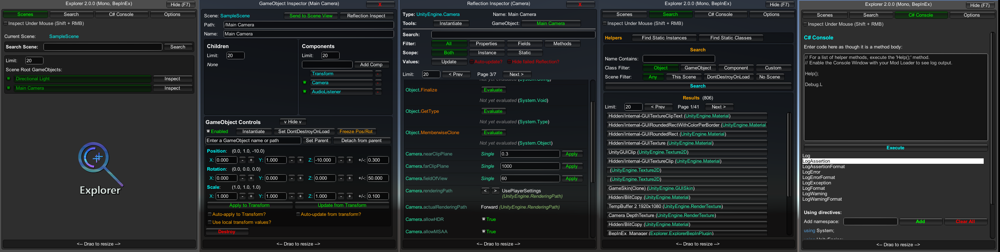

# CppExplorer [](https://github.com/HerpDerpinstine/MelonLoader)

<p align="center">
  
</p>

<p align="center">
  An in-game explorer and a suite of debugging tools for <a href="https://docs.unity3d.com/Manual/IL2CPP.html">IL2CPP</a> Unity games, using <a href="https://github.com/HerpDerpinstine/MelonLoader">MelonLoader</a>.<br><br>

  <a href="../../releases/latest">
    
  </a>
 
  
</p>
<p align="center">   
  <a href="https://github.com/sinai-dev/MonoExplorer">Looking for a Mono version?</a>
</p>

- [Known issues](#known-issues)
- [How to install](#how-to-install)
- [How to use](#how-to-use)
  - [Mod Config](#mod-config)
- [Features](#features)
  - [Mouse Control](#mouse-control)
- [Building](#building)
- [Credits](#credits)

## Known issues
As of version 1.7+, CppExplorer has reached a fairly stable state for most Il2Cpp games.

* .NET 3.5 is not currently supported (Unity 5.6.1 and older), this might change in the future.
* Some methods may still fail with a `MissingMethodException`, please let me know if you experience this (with full MelonLoader log please).
* Reflection may fail with certain types, see [here](https://github.com/knah/Il2CppAssemblyUnhollower#known-issues) for more details.
* Scrolling with mouse wheel in the CppExplorer menu may not work on all games at the moment.

## How to install

Requires [MelonLoader](https://github.com/HerpDerpinstine/MelonLoader) to be installed for your game.

1. Download <b>CppExplorer.zip</b> from [Releases](https://github.com/sinai-dev/CppExplorer/releases).
2. Unzip the file into the `Mods` folder in your game's installation directory, created by MelonLoader.
3. Make sure it's not in a sub-folder, `CppExplorer.dll` and `mcs.dll` should be directly in the `Mods\` folder.

## How to use

* Press F7 to show or hide the menu.
* Use the Scene Explorer or the Object Search to start Exploring, or the C# Console to test some code.
* See below for more specific details.

### Mod Config

There is a simple Mod Config for the CppExplorer, which is generated the first time you run it.

This config is generated to `Mods\CppExplorer\config.xml`. Edit the config while the game is closed if you wish to change it.

`Main_Menu_Toggle` (KeyCode)
* Sets the keybinding for the Main Menu toggle (show/hide all CppExplorer windows)
* See [this article](https://docs.unity3d.com/ScriptReference/KeyCode.html) for a full list of all accepted KeyCodes.
* Default: `F7`

`Default_Window_Size` (Vector2)
* Sets the default width and height for all CppExplorer windows when created.
* `x` is width, `y` is height.
* Default: `<x>550</x> <y>700</y>`

## Features
[](overview.png)

<i>An overview of the different CppExplorer menus.</i>

### Scene Explorer

* A simple menu which allows you to traverse the Transform heirarchy of the scene.
* Click on a GameObject to set it as the current path, or <b>Inspect</b> it to send it to an Inspector Window.

### Inspectors

CppExplorer has two main inspector modes: <b>GameObject Inspector</b>, and <b>Reflection Inspector</b>.

<b>Tips:</b> 
* When in Tab View, GameObjects are denoted by a [G] prefix, and Reflection objects are denoted by a [R] prefix.
* Hold <b>Left Shift</b> when you click the Inspect button to force Reflection mode for GameObjects and Transforms.

### GameObject Inspector

* Allows you to see the children and components on a GameObject.
* Can use some basic GameObject Controls such as translating and rotating the object, destroy it, clone it, etc.

### Reflection Inspector

* The Reflection Inspector is used for all other supported objects.
* Allows you to inspect Properties, Fields and basic Methods, as well as set primitive values and evaluate primitive methods.
* Can search and filter members for the ones you are interested in.

### Object Search

* You can search for an `UnityEngine.Object` with the Object Search feature.
* Filter by name, type, etc.
* For GameObjects and Transforms you can filter which scene they are found in too.

### C# REPL console

* A simple C# REPL console, allows you to execute a method body on the fly.

### Inspect-under-mouse

* Press Shift+RMB (Right Mouse Button) while the CppExplorer menu is open to begin Inspect-Under-Mouse.
* Hover over your desired object, if you see the name appear then you can click on it to inspect it.
* Only objects with Colliders are supported.

### Mouse Control

CppExplorer can force the mouse to be visible and unlocked when the menu is open, if you have enabled "Force Unlock Mouse" (Left-Alt toggle). However, you may also want to prevent the mouse clicking-through onto the game behind CppExplorer, this is possible but it requires specific patches for that game.

* For VRChat, use [VRCExplorerMouseControl](https://github.com/sinai-dev/VRCExplorerMouseControl)
* For Hellpoint, use [HPExplorerMouseControl](https://github.com/sinai-dev/Hellpoint-Mods/tree/master/HPExplorerMouseControl/HPExplorerMouseControl)
* You can create your own plugin using one of the two plugins above as an example. Usually only a few simple Harmony patches are needed to fix the problem.

For example:
```csharp
using Explorer;
using Harmony;
// ...
[HarmonyPatch(typeof(MyGame.MenuClass), nameof(MyGame.MenuClass.CursorUpdate)]
public class MenuClass_CursorUpdate 
{
	[HarmonyPrefix]
	public static bool Prefix()
	{
		// prevent method running if menu open, let it run if not.
		return !CppExplorer.ShowMenu;
	}
}
```

## Building

If you'd like to build this yourself, everything you need (other than MelonLoader) is included with this repository, there is no need for recursive cloning etc.

1. Install MelonLoader for your game.
2. Open the `src\CppExplorer.csproj` file in a text editor.
3. Scroll down until you see the `<ItemGroup>` containing the References.
4. Fix all of the paths in the `..\Steam\` directory for your game (use the full path if you need to).
5. Open the `src\CppExplorer.sln` project and build it.
6. The dll is built to the `Release\` folder in the root of the repository.

## Credits

Written by Sinai.

Thanks to:
* [ManlyMarco](https://github.com/ManlyMarco) for their [Runtime Unity Editor](https://github.com/ManlyMarco/RuntimeUnityEditor), which I used for the REPL Console and the "Find instances" snippet, and the UI style.
* [denikson](https://github.com/denikson) for [mcs-unity](https://github.com/denikson/mcs-unity). I commented out the `SkipVisibilityExt` constructor since it was causing an exception with the Hook it attempted.
